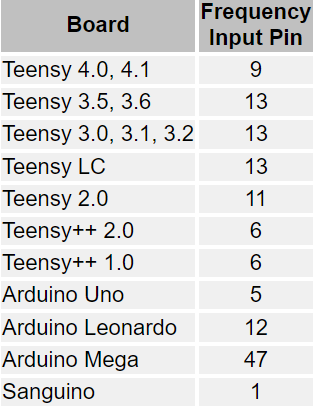

# Simple ATtiny25/45/85 Internal RC Oscillator Calibration/Tunning
==

It's a simple way to calibrate ATtiny25/45/85's OSCCAL, only need a Arduino Uno/Nano and etc. ..a breadboard and some wires. Then on your serial monitor you wil get a list of OSCCAL and frequency. The frequency is set to 100KHz, so you can choose the closest value for you OSCCAL.

**How it works:**
==
The Attiny(call it slave) uses timer1 to output 100kHz waveform when power on. The Arduino Uno(or Nano... call it master) works a frequency meter to messure the frequency that the slave output. Then the master use I2C to send a request to the slave. Atter received the request, the slave load OSCCAL(that will change the frequency of output waveform) and send the OSCCAL value to master. So the master can display the OSCCAL value the frequency on serial monitor.

**Hardware:**
==
One Arduino Uno/Nano/Pro mini etc., one Attiny25/45/85, one breadboard and some jump wires. The Attiny25/45/85 runs at 8MHz(no fuse changed) .

Usually we don't need test OSCCAL from 0, so we begin at 50 to expedite the test. But you can still begin from 0 if you connect PB3 to GND before power on. And the sketch will check PB3's status after OSCCAL increased to 255, when PB3 is high(default pulluped) it will loop from 50, if PB3 is low, it will begin from 0, so you can connect PB3 to groud white running, only need to wait the OSCCAL increases to 255.

**Software:**
==
The Atting need the library TinyWireS(https://github.com/nadavmatalon/TinyWireS),  and the Arduino Uno need FreqCount(https://www.pjrc.com/teensy/td_libs_FreqCount.html). If you use Teensy or Mega or else, you need to change the input pin.

Two sketches, one for Arduino Uno/Nano as master,  one for Attiny25/45/85 as slave. 
If you don't know how to program Attiny, read this: [How to Program an Attiny85 Using a Arduino Uno](https://www.instructables.com/How-to-Program-an-Attiny85-From-an-Arduino-Uno/)
